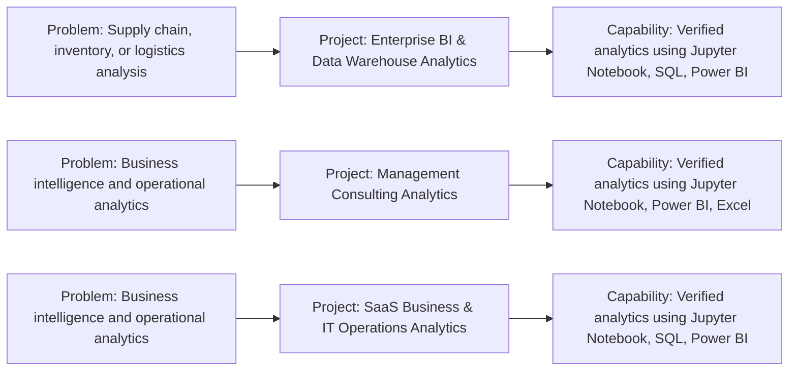

# IT  IT Services  Consulting  BI Portfolio

### Interactive recruiter-facing portfolio of evidence-based IT  IT Services  Consulting  BI projects

    

---

## Project Application Map

> **First-view visual:** what each project is applied to, which project addresses it, and what verified capability the repository demonstrates.

## Portfolio Overview

This portfolio is an independent GitHub portfolio for **IT  IT Services  Consulting  BI**. Each project below has its own repository, interactive README, technology badges, and project-specific working architecture/workflow visual.

## Problems / Applications Covered

The application areas below are derived conservatively from project names and available project documentation. Unsupported business outcomes are not claimed.

## Interactive Project Explorer

| # | Project | Application / Problem | Technologies | Repository |
|---|---------|-----------------------|--------------|------------|
| 1 | [Enterprise BI & Data Warehouse Analytics](https://github.com/gawandeshil03-ops/enterprise-bi-and-data-warehouse-analytics-portfolio) | Supply chain, inventory, or logistics analysis | Jupyter Notebook, SQL, Power BI, CSV | [Repository](https://github.com/gawandeshil03-ops/enterprise-bi-and-data-warehouse-analytics-portfolio) |
| 2 | [Management Consulting Analytics](https://github.com/gawandeshil03-ops/management-consulting-analytics-portfolio) | Business intelligence and operational analytics | Jupyter Notebook, Power BI, Excel | [Repository](https://github.com/gawandeshil03-ops/management-consulting-analytics-portfolio) |
| 3 | [SaaS Business & IT Operations Analytics](https://github.com/gawandeshil03-ops/saas-business-and-it-operations-analytics-portfolio) | Business intelligence and operational analytics | Jupyter Notebook, SQL, Power BI, CSV | [Repository](https://github.com/gawandeshil03-ops/saas-business-and-it-operations-analytics-portfolio) |

## Capabilities Demonstrated

Each project connects a verified problem/application area to the technologies and analytical components actually present in its repository. Open a project to inspect its individual working visual and implementation evidence.

## Technology Coverage

Jupyter Notebook, SQL, Power BI, CSV, Excel

    

## How to Explore This Portfolio

1. Start with the **Project Application Map** above.
2. Choose a project from the **Interactive Project Explorer**.
3. Open the project's GitHub repository.
4. Review its **Project Architecture / Workflow** visual.
5. Inspect its verified technology stack, working components, project structure, and source files.

## README Standard

Every project README in this portfolio is designed as a recruiter-facing landing page with clickable Shields.io badges, repository navigation, technology badges, professional tables, and a visual explaining how that specific project works.

## Contact

- GitHub: https://github.com/gawandeshil03-ops
- LinkedIn: https://www.linkedin.com/in/shilgawande2004
- Email: gawandeshil9@gmail.com