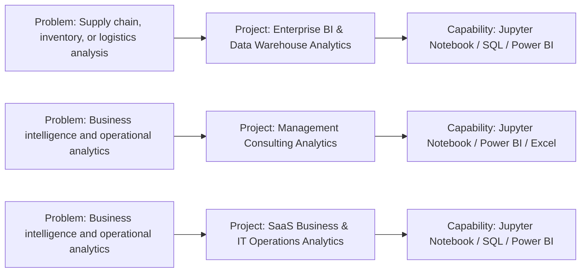

# IT  IT Services  Consulting  BI Portfolio

### Independent recruiter-facing portfolio for the IT  IT Services  Consulting  BI domain.

    

## About This Portfolio

This is an independent domain portfolio. It groups only the projects found in the local $(@{Name=IT  IT Services  Consulting  BI; Source=C:\Users\Shil Gawande\Desktop\Analytics Project\IT  IT Services  Consulting  BI; Repo=it-it-services-consulting-bi-portfolio; Projects=System.Collections.Generic.List`1[System.Object]}.Name) folder and documents them using verified repository evidence.

## Problems Addressed

The visual below shows the problems addressed by this domain's projects and the capabilities demonstrated. This domain portfolio is a separate GitHub entity and is not connected to a master portfolio.

## Problem -> Project -> Solution / Capability

## Project Explorer

| # | Project | Problem / Purpose | Technologies | Repository |
|---|---------|-------------------|--------------|------------|
| 1 | [Enterprise BI & Data Warehouse Analytics](https://github.com/gawandeshil03-ops/enterprise-bi-and-data-warehouse-analytics-portfolio) | Supply chain, inventory, or logistics analysis | Jupyter Notebook, SQL, Power BI, CSV | [Repository](https://github.com/gawandeshil03-ops/enterprise-bi-and-data-warehouse-analytics-portfolio) |
| 2 | [Management Consulting Analytics](https://github.com/gawandeshil03-ops/management-consulting-analytics-portfolio) | Business intelligence and operational analytics | Jupyter Notebook, Power BI, Excel | [Repository](https://github.com/gawandeshil03-ops/management-consulting-analytics-portfolio) |
| 3 | [SaaS Business & IT Operations Analytics](https://github.com/gawandeshil03-ops/saas-business-and-it-operations-analytics-portfolio) | Business intelligence and operational analytics | Jupyter Notebook, SQL, Power BI, CSV | [Repository](https://github.com/gawandeshil03-ops/saas-business-and-it-operations-analytics-portfolio) |

## Technologies Across This Portfolio

Jupyter Notebook, SQL, Power BI, CSV, Excel

## How to Explore

Open any project from the Project Explorer to see that project's own architecture/workflow, structure, technologies, and source files.

## Contact

- GitHub: https://github.com/gawandeshil03-ops
- LinkedIn: https://www.linkedin.com/in/shilgawande2004
- Email: gawandeshil9@gmail.com

